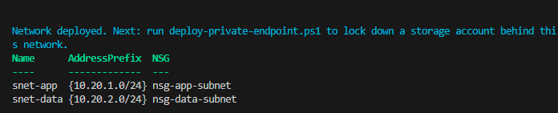
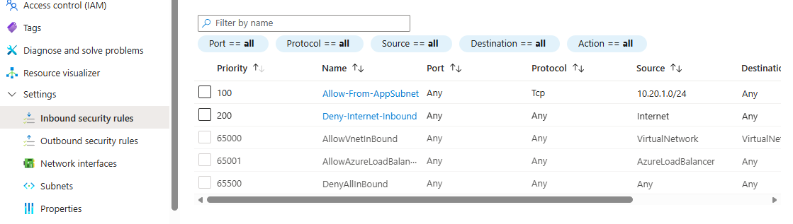
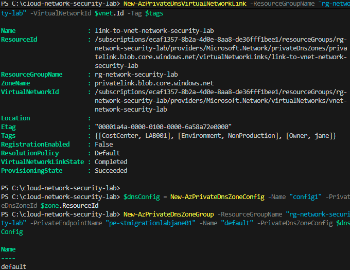
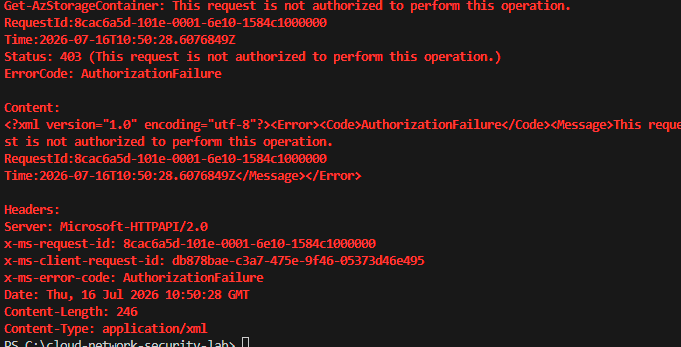
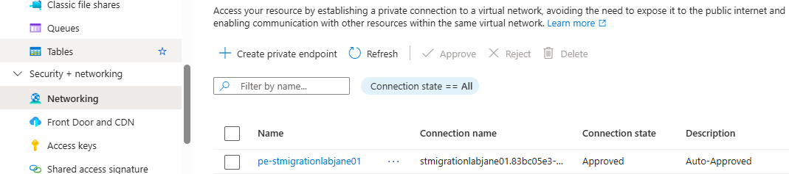

# Network Security Lab: Segmentation, NSGs, and Private Endpoints

**Least-privilege network architecture - a segmented VNet, deny-by-default
Network Security Groups, and a Private Endpoint removing a storage account
from the public internet entirely - built on Azure's genuinely free
networking primitives.**

Every project in this portfolio so far has secured *identity* (who can
authenticate) and *access* (what a authenticated identity can do), but none
has addressed *network reachability* - whether a resource is exposed to the
internet at all in the first place. This lab closes that gap: the same
least-privilege discipline applied to RBAC roles and Key Vault access
elsewhere in this portfolio, applied here to network traffic itself.

## Why This Is a Genuinely Safe Free-Tier Build

Virtual Networks, subnets, and Network Security Groups carry **no charge at
all** - they're free Azure Resource Manager constructs, not billed
resources, and none of them touch the VM compute quota that blocked three
earlier attempts in this portfolio (Function Apps, AKS, Databricks) on this
subscription. The one component with a genuine (small) cost is the Private
Endpoint itself, at roughly GBP 0.01/hour - flagged honestly rather than
claimed as free.

## What's Included

| Component | Purpose |
|---|---|
| [`scripts/deploy-network.ps1`](scripts/deploy-network.ps1) | Deploys the VNet, two subnets, and their NSGs with least-privilege rules |
| [`scripts/deploy-private-endpoint.ps1`](scripts/deploy-private-endpoint.ps1) | Locks a storage account down from public access, reachable only via Private Endpoint inside the VNet |
| [`docs/architecture.md`](docs/architecture.md) | Design rationale: subnet segmentation, NSG rule design, Private Endpoint vs. Service Endpoint |
| [`docs/architecture-diagram.md`](docs/architecture-diagram.md) | Visual diagram of the network topology and traffic rules |
| [`docs/setup-guide.md`](docs/setup-guide.md) | Full reproduction steps with screenshot evidence points |
| [`docs/screenshots/`](docs/screenshots/) | Evidence of the network topology and access restriction actually working |

## Network Design Summary

| Element | Value | Purpose |
|---|---|---|
| VNet address space | `10.20.0.0/16` | Private address range for this lab |
| App subnet | `10.20.1.0/24` | Models a front-end/application tier |
| Data subnet | `10.20.2.0/24` | Models a data tier - where the Private Endpoint lives |
| App subnet NSG | Allow HTTPS (443) inbound from Internet only | Simulates a web-facing tier, nothing else reachable |
| Data subnet NSG | Allow inbound from app subnet only; explicit deny from Internet | Data tier reachable only from the application tier, never directly |

## Cost

- **VNet, subnets, NSGs**: no charge
- **Private Endpoint**: a small hourly charge (roughly GBP 0.01/hour) - the one
  genuinely non-free component in this lab, stated honestly
- **Private DNS Zone**: no charge for the zone itself; negligible query
  volume at this lab's scale

## Screenshots

Evidence of the network deployment, the NSG rules, and the access restriction actually working - captured against a live Azure subscription during this build. Files live in `docs/screenshots/`.

**1. Network Deployed**

The VNet, both subnets, and their respective NSGs confirmed via PowerShell verification output - the foundation every later step in this project depends on.

**2. NSG Rules Confirmed in Portal**

The data subnet's NSG showing `Allow-From-AppSubnet` and the explicit `Deny-Internet-Inbound` rule, alongside Azure's default rules underneath.

**3. Private Endpoint Created**

The Private Endpoint and its Private DNS configuration successfully deployed, with `PublicNetworkAccess: Disabled` confirmed on the target storage account.

**4. Public Access Genuinely Blocked**

A valid storage account key - the most privileged credential available, requiring no RBAC data role - rejected with `403 AuthorizationFailure` purely because the request originated outside the VNet. This took three progressively cleaner test attempts to isolate properly from authentication noise, and is the single strongest piece of evidence in this project.

**5. Private Endpoint Approved**

The Private Endpoint connection confirmed as **Approved** directly on the storage account's own Networking blade.

## Setup Guide

Full steps: [`docs/setup-guide.md`](docs/setup-guide.md).

## Skills Demonstrated

- **Network segmentation**: subnet design separating application and data
  tiers, rather than a flat network
- **NSG rule design**: deny-by-default with explicit, minimal allow rules,
  the same least-privilege discipline applied to RBAC and Key Vault access
  elsewhere in this portfolio, applied to network traffic
- **Private Endpoints**: removing a PaaS resource from public internet
  exposure entirely, rather than relying on firewall rules alone
- **Private DNS integration**: understanding why Private Endpoints require
  DNS zone configuration to actually resolve correctly from inside the VNet
- **Defence in depth**: network-layer controls as one layer among several
  (identity, RBAC, network) rather than a single point of protection

## Conclusion

This project set out to close a real gap in this portfolio: every earlier
project secured identity and access, but none had addressed whether a
resource was reachable from the public internet at all. That gap is closed
here - a segmented VNet with deny-by-default NSGs, and a Private Endpoint
that removes a storage account from public exposure entirely, verified not
by configuration alone but by a genuine, unambiguous failed access attempt
from outside the network.

That verification step is worth calling out specifically. The first two
attempts to prove public access was blocked both looked like evidence but
weren't: a bare request to the account root returned a generic parameter
error regardless of network settings, and an RBAC-authenticated request
could fail identically due to a missing data-plane role, independent of
whether the network control was working at all. Recognising that ambiguity,
rather than accepting the first plausible-looking failure as proof, and
narrowing down to a test using the account key specifically - the one
credential that removes every other variable - is the actual skill this
project demonstrates most clearly. A security control that "looks blocked"
and a security control that's been rigorously proven blocked are different
claims, and only one of them is worth putting in front of an employer.

This also marks the point where this portfolio's tag governance policy,
deployed in the very first cost governance project, caught its fourth
distinct resource across four separate later projects - an Automation
Account, a Function App, a Workbook, and now a Private DNS Zone. That
consistency, entirely automatic and entirely unplanned at the time each
later project was built, is what policy-based governance is actually for.

## Author

Jane - Cloud & Infrastructure Engineer, AZ-104 candidate.
Part of a broader Azure governance and security portfolio.