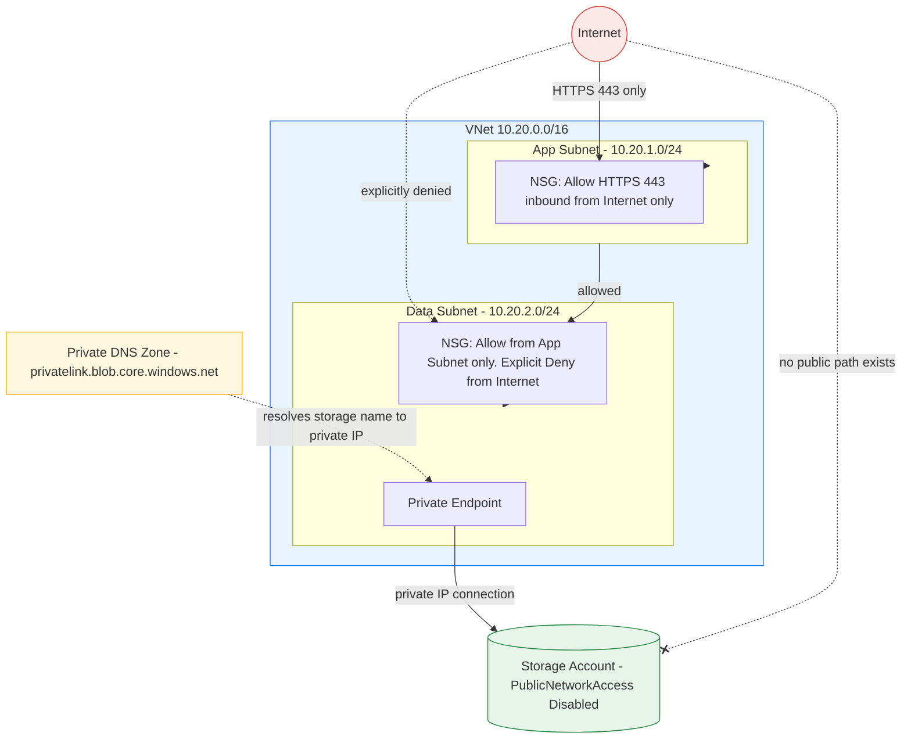

# Architecture Diagram

## Reading This Diagram

**The app subnet** accepts only HTTPS traffic from the internet - modelling
a legitimate public-facing web tier.

**The data subnet** accepts traffic only from the app subnet, with an
explicit deny rule for direct internet access, stating the security intent
plainly rather than relying on NSGs' implicit default deny.

**The storage account**, once PublicNetworkAccess is disabled, has no
public network path at all - the red dashed line with an X shows that
direct internet-to-storage connectivity, which existed before this lab's
build, no longer exists after it. The only path in is through the Private
Endpoint, resolvable only via the Private DNS zone linked to this specific
VNet.